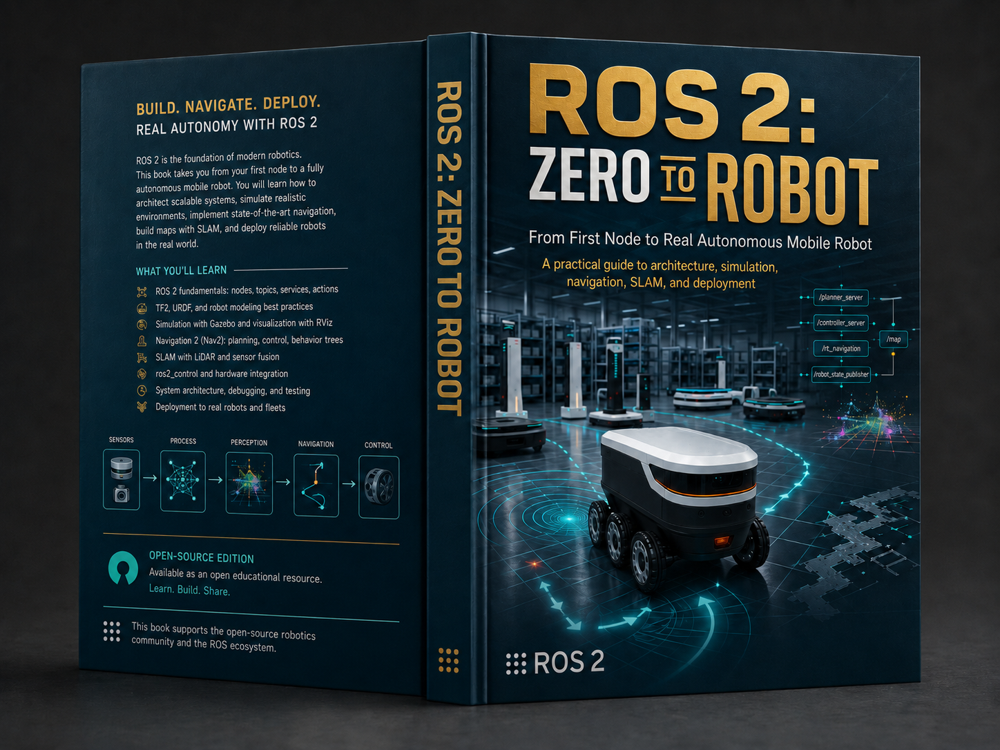
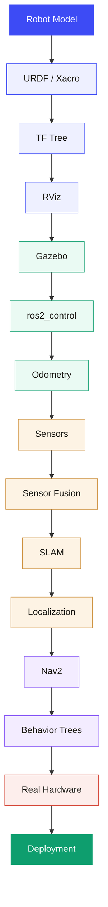

# ROS 2: Zero to Robot

  

  <strong>From First Node to Real Autonomous Mobile Robot</strong>

  A visual, project-based ROS 2 book that takes you from the fundamentals of ROS 2 to the architecture, simulation, control, autonomy, and deployment of a real autonomous mobile robot.

  <a href="https://pouya-mansournia.github.io/ros2-zero-to-robot/"><strong>Read the Book Online →</strong></a>
  &nbsp;&nbsp;•&nbsp;&nbsp;
  <a href="https://github.com/Pouya-Mansournia/warehouse-amr-ros2"><strong>Explore the Companion Robot →</strong></a>
  &nbsp;&nbsp;•&nbsp;&nbsp;
  <a href="https://doi.org/10.5281/zenodo.21843441"><strong>DOI →</strong></a>

  

---

## Overview

**ROS 2: Zero to Robot** is a complete, project-driven introduction to ROS 2, written for readers who want to understand not only *how* ROS 2 works, but also *why* its architecture exists and how the individual pieces come together in a real robotic system.

The book starts with the very first ROS 2 concepts—nodes, topics, services, actions, workspaces, packages, and launch files—and progressively builds toward a complete autonomous mobile robot architecture.

Instead of teaching isolated examples, the entire book follows one continuous robot project:

> **ARCHO — a warehouse Autonomous Mobile Robot (AMR)**

ARCHO evolves throughout the book from a simple robot description into a complete system with simulation, control, localization, mapping, navigation, hardware interfaces, distributed communication, deployment, and real-world safety considerations.

The current edition is built around **ROS 2 Jazzy**.

---

## What You Will Learn

The book covers the complete path from ROS 2 fundamentals to real-world deployment, including:

- ROS 2 architecture and communication model
- Nodes, topics, services, actions, parameters, and launch systems
- Workspaces, packages, dependencies, and build tools
- TF2 and coordinate-frame architecture
- URDF and Xacro robot modeling
- RViz visualization and debugging
- Gazebo simulation
- `ros2_control`
- Differential-drive control and odometry
- Sensor integration and sensor fusion
- SLAM and map generation
- Localization
- Nav2 autonomous navigation
- Behavior Trees
- MoveIt 2
- Multi-robot systems and fleet architecture
- Docker and CI/CD for robotics
- Jetson, Raspberry Pi, and ESP32 integration
- CAN bus and EtherCAT
- DDS and QoS design
- Sim-to-real deployment
- Reliability and safety considerations for real robots

A dedicated practical appendix also covers the complete:

**SolidWorks → URDF → ROS 2**

workflow for real robot assemblies, including coordinate systems, parent-child relationships, joints, axes, exported meshes, validation, and debugging.

---

## Book Structure

The book contains **20 chapters and one practical appendix**, organized into six major parts.

| Part | Focus |
| --- | --- |
| **Part I** | ROS 2 Foundations — architecture, development environment, nodes, communication, and packages |
| **Part II** | Building ARCHO — URDF, Xacro, TF2, and RViz |
| **Part III** | Simulation & Control — Gazebo, `ros2_control`, actuators, and odometry |
| **Part IV** | Perception & Autonomy — sensor fusion, SLAM, Nav2, Behavior Trees, and MoveIt 2 |
| **Part V** | Scaling & Software Delivery — multi-robot architecture, Docker, and CI/CD |
| **Part VI** | Industrial Deployment — Jetson, Raspberry Pi, ESP32, CAN, EtherCAT, DDS/QoS, and sim-to-real |
| **Appendix** | Practical SolidWorks-to-URDF workflow for real robotic assemblies |

---

## The ARCHO Project

ARCHO is the continuous reference robot used throughout the book.

Rather than introducing a new disconnected example in every chapter, each concept becomes another layer of the same robot architecture.

The project gradually develops through stages such as:

This structure is intended to show how ROS 2 components interact as an engineering system rather than as isolated tutorials.

---

## Companion Repository

The fully modeled ARCHO robot and related ROS 2 resources are available in the companion repository:

**[warehouse-amr-ros2 →](https://github.com/Pouya-Mansournia/warehouse-amr-ros2)**

The repository is designed to complement the concepts explained in the book and provide a practical reference for robot modeling and development.

---

## Read the Book

The book is published as a lightweight static website and can be read directly through GitHub Pages:

### [Read ROS 2: Zero to Robot →](https://pouya-mansournia.github.io/ros2-zero-to-robot/)

You can also open `index.html` locally in any modern browser.

The website includes:

- Light and dark reading modes
- Built-in chapter navigation
- Diagrams and technical illustrations
- Code examples
- Practical engineering workflows
- No build step
- Pure static HTML

---

## Learning Philosophy

The book follows a simple principle:

> Understand the system before memorizing the commands.

Each major topic is approached from four perspectives:

1. **Why it exists**
2. **What problem it solves**
3. **How it works internally**
4. **How to use it in a real robot**

The goal is to make ROS 2 understandable even for readers encountering robotics middleware for the first time, while still progressing toward architecture and deployment patterns used in real robotic systems.

---

## References & Acknowledgements

This book was developed with reference to the official **Robot Operating System (ROS)** ecosystem, documentation, concepts, technical resources, and community knowledge.

The primary upstream technical reference is:

### ROS — Robot Operating System

**[https://www.ros.org/](https://www.ros.org/)**

Official ROS documentation and resources provide the technical foundation for many ROS and ROS 2 concepts discussed throughout this book.

The educational structure, explanations, diagrams, examples, ARCHO project, SolidWorks workflow, engineering interpretations, and learning progression in **ROS 2: Zero to Robot** have been independently written, designed, and organized for this project.

This repository is an **independent educational resource** and is not an official publication of Open Robotics, the Open Source Robotics Foundation, or the ROS project.

ROS and ROS 2 names and trademarks belong to their respective owners.

---

## Open Educational Resource

This project is intentionally published as an open educational resource.

The goal is to make practical ROS 2 and robotics engineering knowledge easier to access, study, reuse, and improve.

If you find an error, outdated ROS behavior, unclear explanation, or an opportunity to improve an example, contributions and technical feedback are welcome.

---

## License

The educational content of this project is licensed under the:

**Creative Commons Attribution 4.0 International License — CC BY 4.0**

You are free to:

- Share the material
- Adapt the material
- Use it for education
- Build upon it
- Use it commercially

provided that appropriate attribution is given.

See the `LICENSE` file for the complete terms.

---

## Citation

If you use this book in academic work, educational material, workshops, training programs, research, or technical documentation, please cite it.

A machine-readable citation is available through:

`CITATION.cff`

### DOI

[**10.5281/zenodo.21843441**](https://doi.org/10.5281/zenodo.21843441)

---

## Contributing

Contributions are welcome.

Useful contributions may include:

- Technical corrections
- ROS 2 Jazzy compatibility updates
- Improved explanations
- Additional diagrams
- Simulation improvements
- Hardware deployment examples
- Typographical fixes
- Better examples and exercises

For significant changes, opening an issue before submitting a pull request is recommended.

---

## Author

**Pouya Mansournia**

Engineer · Technical Product Manager · Robotics Entrepreneur

---

  <strong>ROS 2: Zero to Robot</strong> 
  Learn the architecture. Build the robot. Deploy the system.

